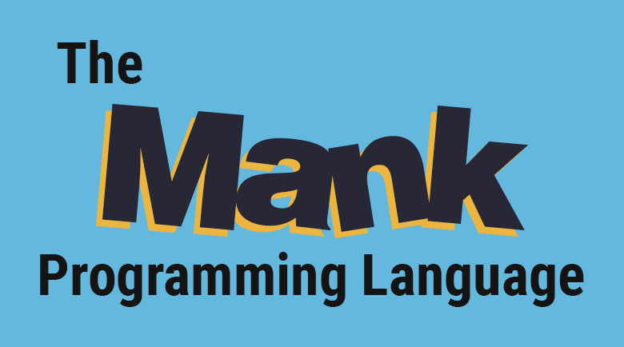

<p align="center">
  
</p>

---

This repo contains the main source code for Mank. It includes the compiler, tests, and some example programs.

The language specification is in another repo: <https://github.com/MacDue/Mank-Spec>

## What is Mank?

```
proc main {
  println!("Hello World");
}
```

Mank is a modern, strongly typed, and garbage-collected mid-level language. Mank aims to provide more safety and portability than C, while also providing high-level features, such as lambdas & closures, type inference, sum types, and more.

Mank was developed for my final year project at the University Of Manchester.

Check out the [examples](./examples) for an idea of how the language works. The most interesting ones are:
- [`xo.mank`](./examples/xo.mank)
  - Noughts and crosses game
- [`raytracer.mank`](./examples/raytracer.mank)
  - Simple raytracer
- [`while_lang.mank`](./examples/while_lang.mank)
  - While language interpreter
- [`manksay.mank`](./examples/manksay.mank)
  - A 'cowsay' like command-line toy
- [`brainfsk.mank`](./examples/brainfsk.mank)
  - A brain f**k (an esoteric programming language) interpreter
- [`epsilon.mank`](./examples/epsilon.mank)
  - Martin Escardo's epsilon function (an "impossible" functional)
- [`modulus.mank`](./examples/modulus.mank)
  - Modulus of continuity (another "impossible" functional)
- [`s_expr_calc.mank`](./examples/s_expr_calc.mank)
  - S-expression calculator

## Online Demo

You can try a version of the Mank compiler running in the browser here: **<https://macdue.github.io/Mank-Explorer/>** (WebAssembly support required).

**NB** You can't currently run the Mank code in the browser, but you can view the output LLVM IR alongside the AST or any compiler errors that may have occurred.

## Building

Note: Mank has only ever been built on Linux -- it would likely work on other platforms but there likely will be some minor fixes needed.

Mank requires **LLVM 10** (later or earlier versions are likely not going to work).
A modern version of `g++` is also needed to compile the Mank compiler (gcc 9.3 was used for development).

From wherever you have cloned this repo to, do the following:

1. Download the submodules
    ```
    git submodule update --init --recursive
    ```

2. Build the compiler (CMake required)
    ```
    mkdir build
    cd build
    cmake -DCMAKE_BUILD_TYPE=Debug .. && make mankc
    ```
    (you can also do `-DDCMAKE_BUILD_TYPE=Release` instead if you like)

3. (Optionally) run the tests
   ```sh
    ./tools/run_all_tests.sh  # (from the root of the repo)
   ```

This will create a `mankc` executable (in the build folder).

## Using the compiler

You can run it directly (e.g. ``./mankc ./hello_world.mank --codegen``), however, this will just print the generated LLVM IR to the standard out.

To produce executables from Mank programs you can use the [`mank.sh`](./tools/mank.sh) script.
For example, from the build folder you can do `../tools/mank.sh ./hello_world.mank` which will create an executable called `hello_world` (in the same folder as the source).

Note: if you use `mank.sh` in another folder you need to set the `MANK_HOME` environment variable to point to a folder that contains the `mankc` executable.
